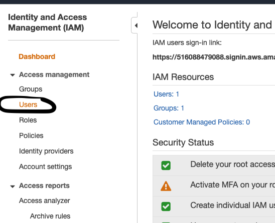
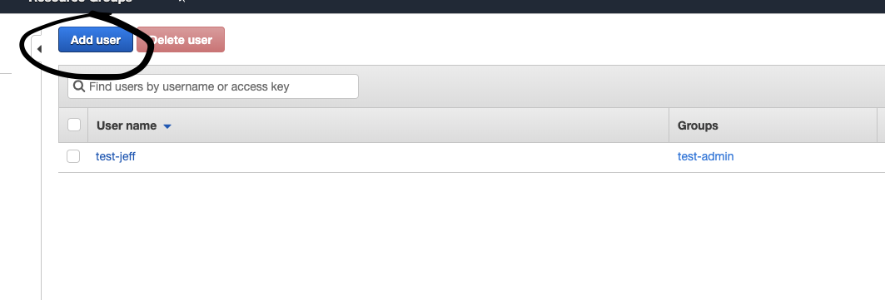

** AWS User **

First let's create a User.

1. First click IAM

2. Click on the `Users` link.

You should see something like:

As you can see we have a user already and it belongs to a group called test-admin. That test-admin group has a policy that has full access to all AWS services. The policy whitelists everything on AWS as you can see here:

We will be adding another user to this group:

3. Going back to the Users screen, click on the `Add User` button:

4. Create a name and check programmatic access because we will be using AWS access keys and secret keys to authenticate ourselves to AWS

Check the user group below to add the user to the group. If you do not see a group below, create one and add the Administrator Access policy to it. I have already done that so you see the group below.

5. Skip adding tags as this doesn't matter for now, click review, and create the user. You should see a screen with your access key and secret access key. This is the only time you'll see the secret access key so write that down for now as we'll be using it soon.